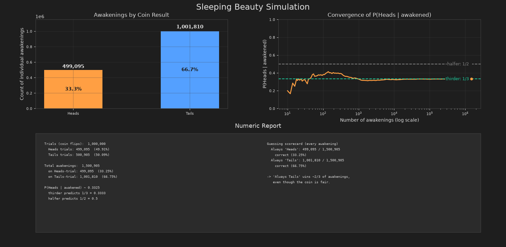

# Sleeping Beauty Simulation

A Monte Carlo simulation of the Sleeping Beauty problem, comparing the
halfer (1/2) and thirder (1/3) answers against the long-run frequency of
awakenings from one million simulated experiments.

- **Experiment** — a fair coin is flipped; Heads means one awakening,
  Tails means two (with her memory erased in between)
- **Monte Carlo simulation** — a million vectorized trials, with every
  awakening counted and scored

## Output



*A typical run: about one third of all awakenings follow a Heads flip, so
"Always Tails" is correct on about two thirds of awakenings even though
the coin itself is exactly fair.*

## Features

- Bar chart of awakenings by coin result
- Convergence plot of $P(\text{Heads} \mid \text{awakened})$ on a
  log-scale axis, with the halfer (1/2) and thirder (1/3) reference lines
- Numeric report with trial counts, awakening counts, and a scorecard for
  the "Always Heads" and "Always Tails" strategies
- Dark theme UI
- Report text that shrinks automatically if it would overflow its panel
- Cross-platform window centering (Tk, Qt, and Wx backends)

## Requirements

- Python 3.9+
- See `requirements.txt`

## Setup

```bash
pip install -r requirements.txt
```

## Usage

```bash
python sleeping_beauty.py
```

A window opens with the charts and the numeric report. Each run uses a
fresh random seed, so the exact numbers change slightly between runs. Set
`N_TRIALS` at the top of the script to change the number of coin flips.

## Math

A fair coin gives $P(\text{Heads}) = P(\text{Tails}) = \tfrac{1}{2}$.
Heads produces 1 awakening and Tails produces 2, so the expected number of
awakenings per experiment is:

$$
E[\text{awakenings}] = 1 \cdot \tfrac{1}{2} + 2 \cdot \tfrac{1}{2} = \tfrac{3}{2}
$$

The fraction of all awakenings that occur after a Heads flip is therefore:

$$
\frac{1 \cdot \tfrac{1}{2}}{\tfrac{3}{2}} = \frac{1}{3}
$$

and the fraction after Tails is $\tfrac{2}{3}$. The simulation draws
`N_TRIALS` coin flips, expands each into its awakenings, and reports these
fractions. A strategy that always guesses Tails is correct on every
awakening that follows Tails, so it scores about $\tfrac{2}{3}$.

Whether this per-awakening frequency is the right answer to Sleeping
Beauty's question is the heart of the halfer/thirder debate: halfers argue
for $\tfrac{1}{2}$ because the coin is fair and waking up gives her no new
information about it. The simulation illustrates the thirder counting
argument rather than settling the debate.

## License

MIT — see [LICENSE](LICENSE).
